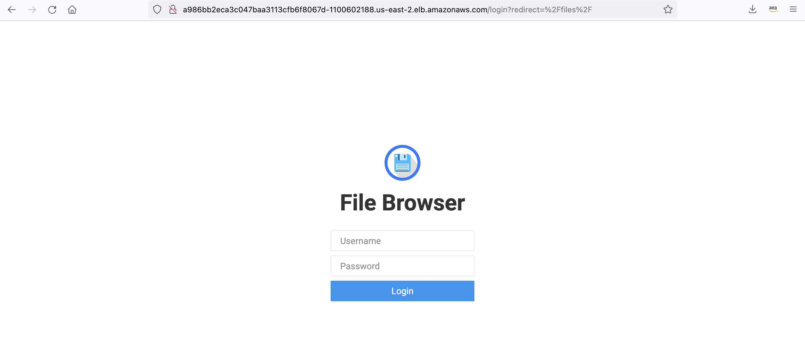
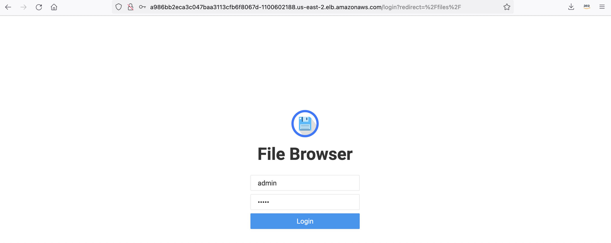
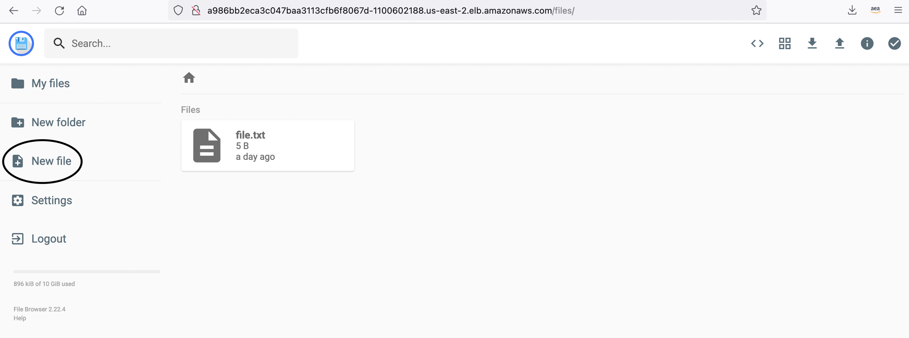
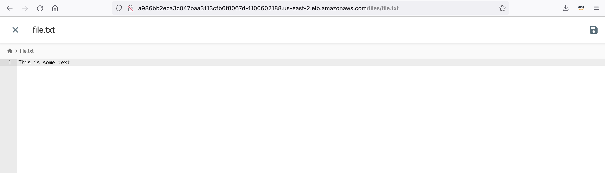
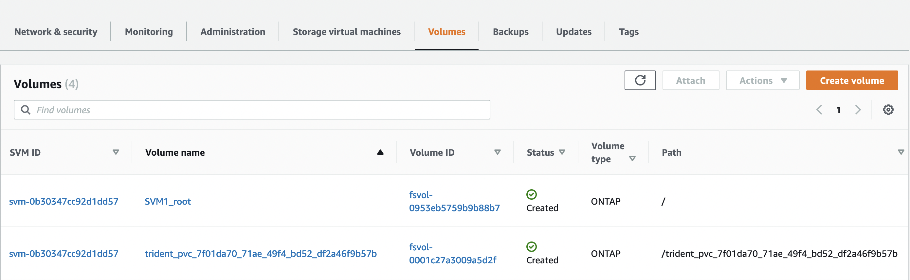
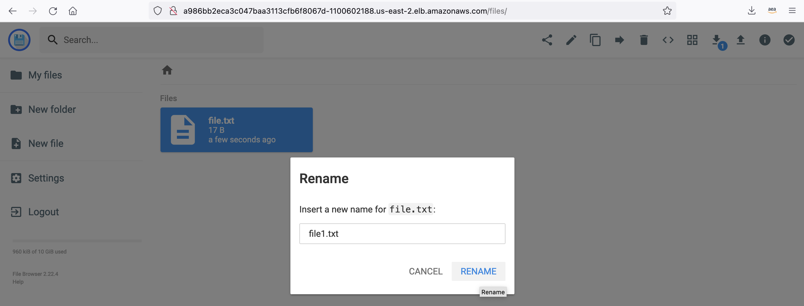
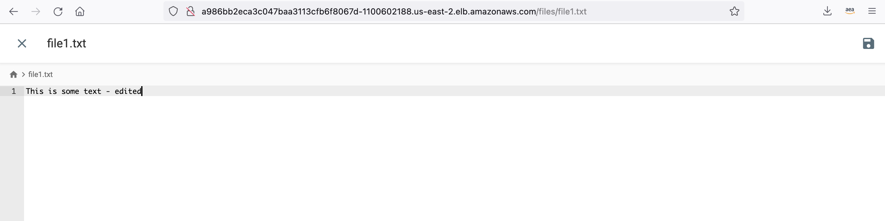
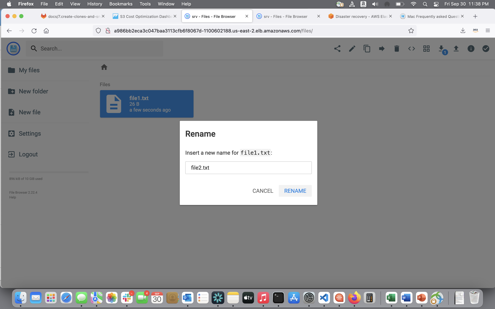
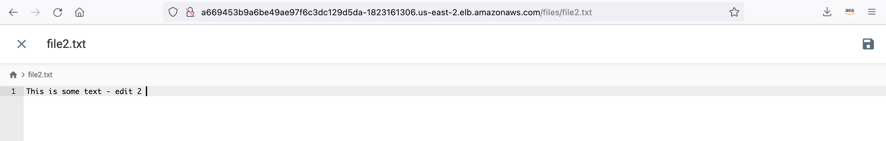
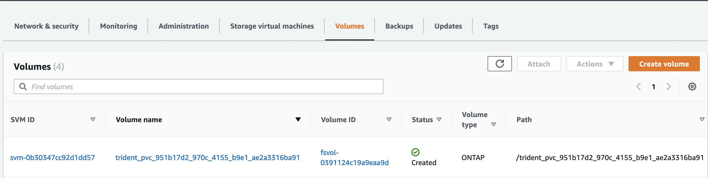

# Clone and Snapshot Volumes

## (1) Deploy a File Browser Web Application

The filebrowser application  manifest is located in the "advanced features" folder as `filebrowser.yaml`.

This deployment will use the PVC "basic" created in section 6.

```yaml
apiVersion: apps/v1
kind: Deployment
metadata:
  name: filebrowser
spec:
  replicas: 1
  selector:
    matchLabels:
      app: filebrowser
      role: file-transfer
  template:
    metadata:
      labels:
        app: filebrowser
        role: file-transfer
    spec:
      containers:
      - name: filebrowser #default login admin/admin
        image: filebrowser/filebrowser
        ports:
        - containerPort: 80
        volumeMounts:
        - name: nfsvol 
          mountPath: /srv
      volumes:
        - name: nfsvol
          persistentVolumeClaim:
            claimName: basic
---
apiVersion: v1
kind: Service
metadata:
  name: filebrowser-service
  labels:
    app: filebrowser
    role: file-transfer
spec:
  type: LoadBalancer
  ports:
   # The port that this service serves on.
    - port: 80
  # Label keys and values that must match in order to receive traffic for this service.
  selector:
    app: filebrowser
    role: file-transfer
```

```bash
$ kubectl apply -f filebrowser.yaml 
deployment.apps/filebrowser created
service/filebrowser-service created

#Check the status of the pod created

$kubectl get pods
NAME                           READY   STATUS    RESTARTS   AGE
filebrowser-559748698c-6qgtn   1/1     Running   0          52s

#Find the url of the loadbalancer 

$kubectl get svc

NAME                  TYPE           CLUSTER-IP     EXTERNAL-IP                                                               PORT(S)        AGE
filebrowser-service   LoadBalancer   172.20.35.43   a669453b9a6be49ae97f6c3dc129d5da-1823161306.us-east-2.elb.amazonaws.com   80:31882/TCP   5m54s

#Copy and paste the url into your web browser
```



Use your credentials (admin/admin) to log into the File Browser Web Application and create a file called file.txt, edit and add some sample text.






## (2) Clone the Volume for the PVC "basic"

The pvc clone manifest is located as `pvc-basic-clone.yaml`.

```yaml
apiVersion: v1
kind: PersistentVolumeClaim
metadata:
  name: basic-clone
spec:
  accessModes:
    - ReadWriteOnce
  storageClassName: trident-csi
  resources:
    requests:
      storage: 10Gi
  dataSource:
    kind: PersistentVolumeClaim
    name: basic
```

```bash
$ kubectl create -f pvc-basic-clone.yaml
persistentvolumeclaim/basic-clone created

#Check the status of the persistent volume created
$ kubectl get pvc

NAME                                     CAPACITY  ACCESS MODES   RECLAIM POLICY  STATUS    CLAIM      STORAGECLASS  REASON  AGE
pvc-7f01da70-71ae-49f4-bd52-df2a46f9b57b  10Gi    RWX             Retain          Bound default/basic-clone  trident-csi           25s
```

When you navigate back to FSxONTAP console, select “Volumes” of your file system, then you can see the corresponding volume has been created:


Now deploy a second File Browser Web Application 

The filebrowser-clone application manifest is located in the Data Protection Folder as `filebrowser-clone.yaml`.

This deployment will use the PVC "basic-clone" created in the steps above.

```yaml
apiVersion: apps/v1
kind: Deployment
metadata:
  name: filebrowser-clone
spec:
  replicas: 1
  selector:
    matchLabels:
      app: filebrowser-clone
      role: file-transfer
  template:
    metadata:
      labels:
        app: filebrowser-clone
        role: file-transfer
    spec:
      containers:
      - name: filebrowser #default login admin/admin
        image: filebrowser/filebrowser
        ports:
        - containerPort: 80
        volumeMounts:
        - name: nfsvol 
          mountPath: /srv
      volumes:
        - name: nfsvol
          persistentVolumeClaim:
            claimName: basic-clone
---
apiVersion: v1
kind: Service
metadata:
  name: filebrowser-clone-service
  labels:
    app: filebrowser-clone
    role: file-transfer
spec:
  type: LoadBalancer
  ports:
   # The port that this service serves on.
    - port: 80
  # Label keys and values that must match in order to receive traffic for this service.
  selector:
    app: filebrowser-clone
    role: file-transfer
```

```bash
$ kubectl apply -f filebrowser-clone.yaml 
deployment.apps/filebrowser-clone created
service/filebrowser-clone-service created

#Check the status of the pod created

$kubectl get pods
NAME                                 READY   STATUS    RESTARTS   AGE
filebrowser-559748698c-6qgtn         1/1     Running   0          31m
filebrowser-clone-649bb794ff-p4wwj   1/1     Running   0          8s

#Find the url of the loadbalancer 

$kubectl get svc
NAME                        TYPE           CLUSTER-IP      EXTERNAL-IP                                                               PORT(S)        AGE
filebrowser-clone-service   LoadBalancer   172.20.112.39   a7d3bf778fee54b49a9fb859c4f1ad0f-649269335.us-east-2.elb.amazonaws.com    80:30137/TCP   104s
filebrowser-service         LoadBalancer   172.20.35.43    a669453b9a6be49ae97f6c3dc129d5da-1823161306.us-east-2.elb.amazonaws.com   80:31882/TCP   32m

#Copy and paste the url of the filebrowser-clone service into a new tab in your web browser
```
Log in with your credentials (admin/admin) and notice the file you created previously also exists here. This is because we cloned the volume and mounted the pvc of the clone in this deployment.


Now navigate back to the browser tab of the first File Browser Web Application and edit the name of the file to become file1.txt and edit the sample text in the file. 




Navigate back to the browser tab for the File Browser-Clone Web Application and refresh the browser. Notice the data has not changed. This is because the clone of the source volume shares the original blocks from when the clone was created but is now a unique volume. 

## (3) Apply the Volume Snapshot CRDs and Volume Snapshot Controller

```bash
# Apply the CRDs for the Snapshot Controller
$ kubectl apply -f https://raw.githubusercontent.com/kubernetes-csi/external-snapshotter/release-5.0/client/config/crd/snapshot.storage.k8s.io_volumesnapshotclasses.yaml
$ kubectl apply -f https://raw.githubusercontent.com/kubernetes-csi/external-snapshotter/release-5.0/client/config/crd/snapshot.storage.k8s.io_volumesnapshotcontents.yaml
$ kubectl apply -f https://raw.githubusercontent.com/kubernetes-csi/external-snapshotter/release-5.0/client/config/crd/snapshot.storage.k8s.io_volumesnapshots.yaml

# Deploy the Snapshot Controller Pods

$ kubectl apply -f https://raw.githubusercontent.com/kubernetes-csi/external-snapshotter/release-5.0/deploy/kubernetes/snapshot-controller/rbac-snapshot-controller.yaml
$ kubectl apply -f https://raw.githubusercontent.com/kubernetes-csi/external-snapshotter/release-5.0/deploy/kubernetes/snapshot-controller/setup-snapshot-controller.yaml

# View the Snapshot Controller Pods 
$ kubectl get pods -n kube-system

NAME                                   READY   STATUS    RESTARTS   AGE
snapshot-controller-75fd799dc8-t2wzl   1/1     Running   0          121m
snapshot-controller-75fd799dc8-tg7km   1/1     Running   0          121m

```

## (4) Create the Volume Snapshot Class

The snapshot class manifest is located as `snapshot-class.yaml`.

```yaml
apiVersion: snapshot.storage.k8s.io/v1
kind: VolumeSnapshotClass
metadata:
  name: trident-snapshotclass
driver: csi.trident.netapp.io
deletionPolicy: Delete
```

```bash
$ kubectl create -f snapshot-class.yaml

# View the Volume Snapshot Class
$ kubectl get VolumeSnapshotClass 

NAME                    DRIVER                  DELETIONPOLICY   AGE
trident-snapshotclass   csi.trident.netapp.io   Delete           91m

```

## (5) Create a Snapshot of the existing PVC "basic"

The snapshot manifest is located as `snapshot.yaml`.

```yaml
apiVersion: snapshot.storage.k8s.io/v1
kind: VolumeSnapshot
metadata:
  name: basic-snap
spec:
  volumeSnapshotClassName: trident-snapshotclass
  source:
    persistentVolumeClaimName: basic
```

```bash
$ kubectl create -f snapshot.yaml

# View the new Snapshot

$ kubectl get vs 

NAME         READYTOUSE   SOURCEPVC   SOURCESNAPSHOTCONTENT   RESTORESIZE   SNAPSHOTCLASS           SNAPSHOTCONTENT                                    CREATIONTIME   AGE
basic-snap   true         basic                               328Ki         trident-snapshotclass   snapcontent-4615c2f3-2668-40a0-b1c4-ed554f2a2990   95m            95m

```
Now modify "file1.txt" once more by changing it to "file2.txt" and update the sample text again. 




# (6) Create a PVC from the Snapshot using a Clone

The pvc from snapshot manifest is located as `pvc-from-snap.yaml`.

```yaml
apiVersion: v1
kind: PersistentVolumeClaim
metadata:
  name: basic-pvc-from-snap
spec:
  accessModes:
    - ReadWriteOnce
  storageClassName: trident-csi
  resources:
    requests:
      storage: 10Gi
  dataSource:
    name: basic-snap
    kind: VolumeSnapshot
    apiGroup: snapshot.storage.k8s.io
```

```bash 
$ kubectl create -f pvc-from-snap.yaml

# View the new PVC

$ Kubectl get pvc

NAME                  STATUS   VOLUME                                     CAPACITY   ACCESS MODES   STORAGECLASS   AGE
basic-pvc-from-snap   Bound    pvc-951b17d2-970c-4155-b9e1-ae2a3316ba91   10Gi       RWO            trident-csi    94m
```
Once again, when you navigate back to FSxONTAP console, select “Volumes” of your file system, then you can see the corresponding volume has been created:


# (7) Mount the new PVC created from the Snapshot to the File Browser Web Application 

```bash
vi filebrowser.yaml

#change the pvc from "basic" to basic-pvc-from-snap" and exit vi with :wq

$kubectl apply -f filebrowser.yaml 
deployment.apps/filebrowser configured
service/filebrowser-service unchanged
```

Log into to the File Browser Web Application again with the credentials (admin/admin) and notice that the file has reverted back to "file.txt" and the sample data has also been reverted.


